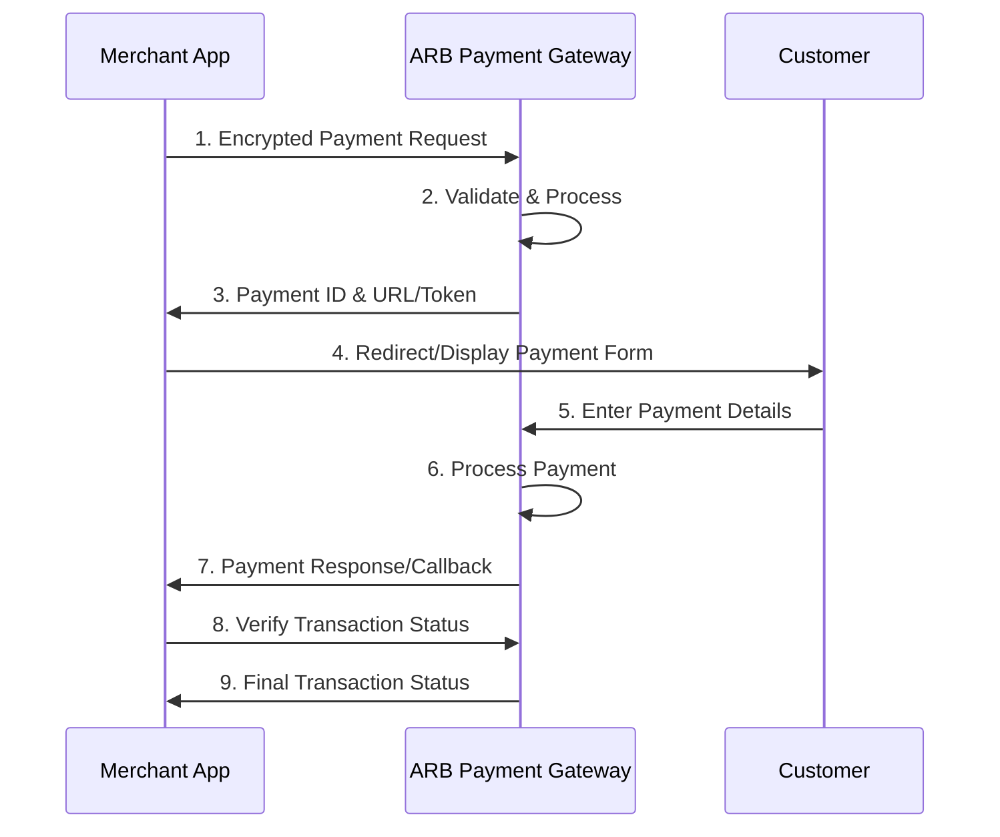

# Building with ARB Payment Gateway

Al Rajhi Bank Payment Gateway offers a secure, PCI-DSS compliant solution for processing various payment methods. This section covers the fundamental concepts you need to understand before implementing your integration.

## Core Features

Al Rajhi Bank Payment Gateway provides comprehensive payment processing capabilities:

::card-group
  :::card
  ---
  icon: i-lucide-shield-check
  title: Security & Compliance
  ---
  - **PCI-DSS Compliant**: Full compliance with Payment Card Industry standards
  - **SSL/TLS Encryption**: Secure data transmission using industry-standard encryption
  - **Tokenization**: Secure storage of payment credentials
  - **3D Secure**: Enhanced authentication for card transactions
  :::

  :::card
  ---
  icon: i-lucide-credit-card
  title: Payment Methods
  ---
  - **Debit Cards**: Visa, MasterCard, and local debit cards
  - **Credit Cards**: International and domestic credit cards
  - **Net Banking**: Direct bank account transfers
  - **Digital Wallets**: URPAY and other supported wallets
  :::

  :::card
  ---
  icon: i-lucide-globe
  title: Multi-Currency Support
  ---
  - **Saudi Riyal (SAR)**: Primary currency for domestic transactions
  - **International Currencies**: Support for major global currencies
  - **Real-time Rates**: Dynamic currency conversion
  - **Settlement Options**: Flexible settlement in preferred currency
  :::

  :::card
  ---
  icon: i-lucide-repeat
  title: Advanced Features
  ---
  - **Recurring Payments**: Automated subscription billing
  - **Card-on-File**: Secure storage for repeat customers
  - **Refunds & Voids**: Complete transaction management
  - **Split Payments**: Multi-party transaction support
  :::
::

## Getting Your Credentials

### Step 1: Merchant Onboarding

Once you complete the merchant onboarding process with Al Rajhi Bank, you'll receive:

- **Payment Gateway Application URL**: Access to the merchant portal
- **Login Credentials**: Username and password for portal access
- **Integration Documentation**: This comprehensive guide

::callout{icon="i-lucide-info" color="blue"}
**Important**: Generate your staging account credentials first. These are essential for exploring and testing ARB Payment Gateway integration solutions before going live.
::

### Step 2: Download Integration Credentials

Log in to the ARB Payment Gateway merchant portal and download the following essential credentials:

#### Tranportal ID & Password
- **Tranportal ID**: Unique identifier for your merchant account
- **Tranportal Password**: Authentication password for API requests
- **Delivery Method**: Provided via registered email and merchant portal
- **Usage**: Required for all API communications with ARB Payment Gateway

#### Resource Key
- **Purpose**: Unique secret key for secure encryption and decryption
- **Security**: Must be kept confidential and never shared
- **Function**: Used to encrypt all request data and decrypt responses
- **Storage**: Store securely in your server environment variables

```php
// Example: Secure credential storage
class ARBConfig {
    private static $credentials = [
        'tranportal_id' => 'YOUR_TRANPORTAL_ID',
        'tranportal_password' => 'YOUR_TRANPORTAL_PASSWORD',
        'resource_key' => 'YOUR_RESOURCE_KEY',
        'environment' => 'sandbox' // or 'production'
    ];
    
    public static function getCredentials() {
        // In production, load from environment variables
        return [
            'tranportal_id' => $_ENV['ARB_TRANPORTAL_ID'] ?? self::$credentials['tranportal_id'],
            'tranportal_password' => $_ENV['ARB_TRANPORTAL_PASSWORD'] ?? self::$credentials['tranportal_password'],
            'resource_key' => $_ENV['ARB_RESOURCE_KEY'] ?? self::$credentials['resource_key'],
            'environment' => $_ENV['ARB_ENVIRONMENT'] ?? self::$credentials['environment']
        ];
    }
}
```

## Integration Architecture

### Request-Response Flow

All ARB Payment Gateway integrations follow a consistent request-response pattern:



### Data Encryption

All sensitive data exchanged with ARB Payment Gateway must be encrypted:

```php
class ARBEncryption {
    private $resourceKey;
    
    public function __construct($resourceKey) {
        $this->resourceKey = $resourceKey;
    }
    
    /**
     * Encrypt data for ARB Payment Gateway
     */
    public function encrypt($data) {
        $jsonData = json_encode($data);
        $encrypted = openssl_encrypt(
            $jsonData,
            'AES-256-CBC',
            $this->resourceKey,
            OPENSSL_RAW_DATA,
            substr($this->resourceKey, 0, 16)
        );
        return base64_encode($encrypted);
    }
    
    /**
     * Decrypt response from ARB Payment Gateway
     */
    public function decrypt($encryptedData) {
        $data = base64_decode($encryptedData);
        $decrypted = openssl_decrypt(
            $data,
            'AES-256-CBC',
            $this->resourceKey,
            OPENSSL_RAW_DATA,
            substr($this->resourceKey, 0, 16)
        );
        return json_decode($decrypted, true);
    }
}
```

## Environment Setup

### Development Environment
- **PHP Version**: 7.4+ or PHP 8.x recommended
- **Extensions**: OpenSSL, cURL, JSON
- **SSL Certificate**: Required for secure communication
- **Database**: MySQL, PostgreSQL, or similar for transaction logging

### Production Requirements
- **HTTPS**: Mandatory for all payment-related pages
- **PCI Compliance**: Ensure your server meets PCI-DSS requirements
- **Monitoring**: Implement logging and monitoring for payment transactions
- **Backup**: Regular backups of transaction data and configurations

## Next Steps

Now that you understand the core concepts, proceed to:

1. **[Basic Understanding](/getting-started/basic-understanding)** - Learn about the merchant portal features
2. **[Payment Basics](/getting-started/payment-basics)** - Understand the payment collection process
3. **[Integration Guidelines](/getting-started/integration-guidelines)** - Follow mandatory integration steps

::callout{icon="i-lucide-arrow-right" color="green"}
**Ready to implement?** Continue to [Payment Basics](/getting-started/payment-basics) to understand how payment collection works with ARB Payment Gateway.
::
