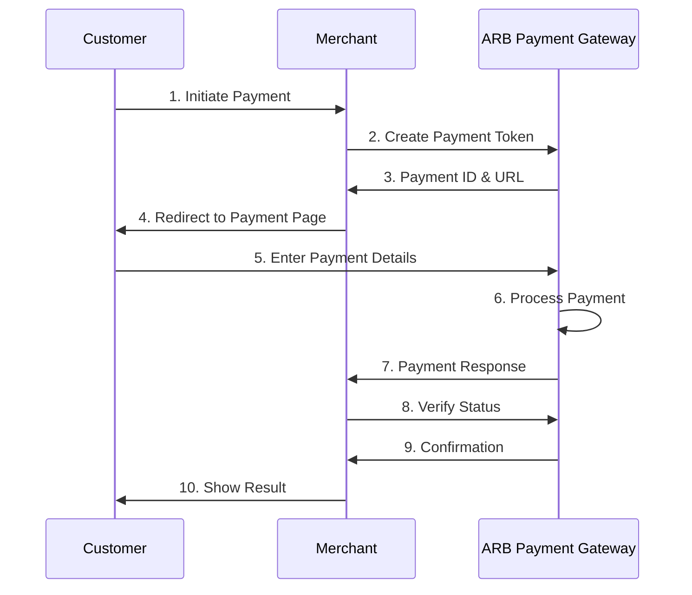

# Bank Hosted Integration

Bank Hosted Integration is the recommended approach for merchants who want to implement payment processing quickly and securely. In this method, customers are redirected to Al Rajhi Bank's secure payment page to enter their payment details.

## Overview

This integration method provides maximum security with minimal development effort. The payment form is hosted and maintained by Al Rajhi Bank, ensuring PCI compliance and reducing your security responsibilities.

### Key Benefits

- **Quick Implementation**: Minimal development time required
- **Maximum Security**: PCI compliance handled by Al Rajhi Bank
- **Mobile Optimized**: Responsive design for all devices
- **Reduced Maintenance**: Payment forms maintained by the bank
- **Built-in Fraud Protection**: Advanced security measures included

## Integration Flow



## Implementation Steps

### Step 1: Create Payment Token

```php
<?php
/**
 * Bank Hosted Payment Implementation
 */
class BankHostedPayment {
    private $gateway;
    
    public function __construct($gateway) {
        $this->gateway = $gateway;
    }
    
    /**
     * Initiate bank hosted payment
     */
    public function initiatePayment($orderData) {
        $paymentParams = [
            'amt' => $orderData['amount'],
            'currencyCode' => '682', // SAR
            'trackId' => $orderData['order_id'],
            'responseURL' => 'https://yoursite.com/payment-callback',
            'errorURL' => 'https://yoursite.com/payment-error',
            'udf1' => $orderData['customer_id'],
            'udf2' => $orderData['customer_email'],
            'udf3' => $orderData['order_reference']
        ];
        
        try {
            $response = $this->gateway->createPaymentToken($paymentParams);
            
            if ($response['success']) {
                // Store payment details for later verification
                $this->storePaymentSession($response['paymentId'], $orderData);
                
                // Redirect to ARB payment page
                $paymentURL = $response['paymentURL'] . '?paymentid=' . $response['paymentId'];
                
                return [
                    'success' => true,
                    'redirect_url' => $paymentURL,
                    'payment_id' => $response['paymentId'],
                    'track_id' => $response['trackId']
                ];
            } else {
                throw new Exception($response['error']);
            }
        } catch (Exception $e) {
            return [
                'success' => false,
                'error' => 'Payment initialization failed: ' . $e->getMessage()
            ];
        }
    }
    
    private function storePaymentSession($paymentId, $orderData) {
        // Store in session or database for later verification
        $_SESSION['payment_' . $paymentId] = [
            'order_id' => $orderData['order_id'],
            'amount' => $orderData['amount'],
            'customer_id' => $orderData['customer_id'],
            'timestamp' => time()
        ];
    }
}
```

### Step 2: Handle Payment Response

```php
<?php
/**
 * Payment callback handler
 */
class PaymentCallbackHandler {
    private $gateway;
    
    public function __construct($gateway) {
        $this->gateway = $gateway;
    }
    
    /**
     * Handle payment callback from ARB
     */
    public function handleCallback() {
        try {
            // Process the callback data
            $callbackResult = $this->gateway->handleCallback($_POST);
            
            if ($callbackResult['success']) {
                // Payment successful
                $this->processSuccessfulPayment($callbackResult);
                return $this->redirectToSuccess($callbackResult);
            } else {
                // Payment failed
                $this->processFailedPayment($callbackResult);
                return $this->redirectToError($callbackResult);
            }
        } catch (Exception $e) {
            error_log('Payment callback error: ' . $e->getMessage());
            return $this->redirectToError(['error' => 'Processing error']);
        }
    }
    
    private function processSuccessfulPayment($callbackResult) {
        $transactionData = $callbackResult['data'];
        
        // Verify payment session
        $paymentId = $callbackResult['paymentId'];
        $sessionData = $_SESSION['payment_' . $paymentId] ?? null;
        
        if (!$sessionData) {
            throw new Exception('Invalid payment session');
        }
        
        // Verify transaction status with ARB
        $statusResult = $this->gateway->getTransactionStatus($paymentId);
        
        if (!$statusResult['success'] || $statusResult['data']['result'] !== 'CAPTURED') {
            throw new Exception('Payment verification failed');
        }
        
        // Update order status in database
        $this->updateOrderStatus($sessionData['order_id'], 'paid', $transactionData);
        
        // Send confirmation email
        $this->sendConfirmationEmail($sessionData['customer_id'], $transactionData);
        
        // Clear payment session
        unset($_SESSION['payment_' . $paymentId]);
    }
    
    private function processFailedPayment($callbackResult) {
        $paymentId = $callbackResult['paymentId'];
        $sessionData = $_SESSION['payment_' . $paymentId] ?? null;
        
        if ($sessionData) {
            // Update order status
            $this->updateOrderStatus($sessionData['order_id'], 'failed', $callbackResult);
            
            // Clear payment session
            unset($_SESSION['payment_' . $paymentId]);
        }
    }
    
    private function redirectToSuccess($callbackResult) {
        $transactionData = $callbackResult['data'];
        $successUrl = 'https://yoursite.com/payment-success?' . http_build_query([
            'transaction_id' => $transactionData['tranid'],
            'amount' => $transactionData['amt'],
            'status' => 'success'
        ]);
        
        header('Location: ' . $successUrl);
        exit;
    }
    
    private function redirectToError($callbackResult) {
        $errorUrl = 'https://yoursite.com/payment-error?' . http_build_query([
            'error' => $callbackResult['error'] ?? 'Payment failed',
            'status' => 'failed'
        ]);
        
        header('Location: ' . $errorUrl);
        exit;
    }
    
    private function updateOrderStatus($orderId, $status, $data) {
        // Update your database with order status
        // Implementation depends on your database structure
    }
    
    private function sendConfirmationEmail($customerId, $transactionData) {
        // Send confirmation email to customer
        // Implementation depends on your email system
    }
}
```

### Step 3: Payment Page Integration

```php
<?php
/**
 * Payment page with bank hosted integration
 */
class PaymentPage {
    private $bankHostedPayment;
    
    public function __construct($bankHostedPayment) {
        $this->bankHostedPayment = $bankHostedPayment;
    }
    
    /**
     * Display payment page
     */
    public function displayPaymentPage($orderData) {
        // Validate order data
        if (!$this->validateOrderData($orderData)) {
            throw new Exception('Invalid order data');
        }
        
        // Initiate payment
        $paymentResult = $this->bankHostedPayment->initiatePayment($orderData);
        
        if ($paymentResult['success']) {
            // Redirect to ARB payment page
            header('Location: ' . $paymentResult['redirect_url']);
            exit;
        } else {
            // Show error page
            $this->showErrorPage($paymentResult['error']);
        }
    }
    
    private function validateOrderData($orderData) {
        $required = ['amount', 'order_id', 'customer_id', 'customer_email'];
        
        foreach ($required as $field) {
            if (!isset($orderData[$field]) || empty($orderData[$field])) {
                return false;
            }
        }
        
        // Validate amount
        if (!is_numeric($orderData['amount']) || $orderData['amount'] <= 0) {
            return false;
        }
        
        return true;
    }
    
    private function showErrorPage($error) {
        echo "<h1>Payment Error</h1>";
        echo "<p>Unable to process payment: " . htmlspecialchars($error) . "</p>";
        echo "<a href='/'>Return to Home</a>";
    }
}
```

## Advanced Features

### Custom Payment Parameters

```php
// Example: Adding custom parameters for enhanced tracking
$paymentParams = [
    'amt' => '150.00',
    'currencyCode' => '682',
    'trackId' => 'ORDER_' . time(),
    'responseURL' => 'https://yoursite.com/payment-callback',
    'errorURL' => 'https://yoursite.com/payment-error',
    
    // Custom fields for additional data
    'udf1' => 'CUSTOMER_ID_12345',
    'udf2' => 'customer@email.com',
    'udf3' => 'ORDER_REF_ABC123',
    'udf4' => 'PRODUCT_CATEGORY_ELECTRONICS',
    'udf5' => 'PROMOTION_CODE_SUMMER2024',
    
    // Language preference (optional)
    'langid' => 'ar' // Arabic language
];
```

### Payment Session Management

```php
class PaymentSessionManager {
    private $sessionTimeout = 1800; // 30 minutes
    
    /**
     * Create secure payment session
     */
    public function createPaymentSession($paymentId, $orderData) {
        $sessionData = [
            'payment_id' => $paymentId,
            'order_data' => $orderData,
            'created_at' => time(),
            'expires_at' => time() + $this->sessionTimeout,
            'status' => 'pending'
        ];
        
        // Store in database or secure session
        $this->storeSession($paymentId, $sessionData);
        
        return $sessionData;
    }
    
    /**
     * Validate payment session
     */
    public function validatePaymentSession($paymentId) {
        $sessionData = $this->getSession($paymentId);
        
        if (!$sessionData) {
            throw new Exception('Payment session not found');
        }
        
        if (time() > $sessionData['expires_at']) {
            $this->clearSession($paymentId);
            throw new Exception('Payment session expired');
        }
        
        return $sessionData;
    }
    
    private function storeSession($paymentId, $sessionData) {
        // Implementation depends on your storage mechanism
        // Could be database, Redis, or secure file storage
    }
    
    private function getSession($paymentId) {
        // Retrieve session data
        return null; // Placeholder
    }
    
    private function clearSession($paymentId) {
        // Clear session data
    }
}
```

## Error Handling

### Common Error Scenarios

```php
class BankHostedErrorHandler {
    
    /**
     * Handle payment initialization errors
     */
    public function handleInitializationError($error) {
        $errorMappings = [
            'IPAY0100061' => [
                'message' => 'Invalid payment amount',
                'action' => 'Please check the amount and try again'
            ],
            'IPAY0100063' => [
                'message' => 'Invalid order reference',
                'action' => 'Please refresh the page and try again'
            ],
            'IPAY0100050' => [
                'message' => 'Merchant configuration error',
                'action' => 'Please contact customer support'
            ]
        ];
        
        $errorCode = $error['code'] ?? 'UNKNOWN';
        $errorInfo = $errorMappings[$errorCode] ?? [
            'message' => 'Payment processing error',
            'action' => 'Please try again or contact support'
        ];
        
        return [
            'error_code' => $errorCode,
            'user_message' => $errorInfo['message'],
            'suggested_action' => $errorInfo['action'],
            'technical_details' => $error['text'] ?? 'No additional details'
        ];
    }
    
    /**
     * Handle callback processing errors
     */
    public function handleCallbackError($error) {
        // Log error for debugging
        error_log('Bank Hosted Callback Error: ' . json_encode($error));
        
        // Return user-friendly error
        return [
            'success' => false,
            'message' => 'Payment processing failed. Please try again.',
            'error_code' => $error['errorCode'] ?? 'CALLBACK_ERROR'
        ];
    }
}
```

## Testing

### Test Implementation

```php
// Example: Test bank hosted integration
$testOrderData = [
    'amount' => '100.00',
    'order_id' => 'TEST_ORDER_' . time(),
    'customer_id' => 'TEST_CUSTOMER_123',
    'customer_email' => 'test@example.com',
    'order_reference' => 'TEST_REF_' . uniqid()
];

$bankHostedPayment = new BankHostedPayment($gateway);
$result = $bankHostedPayment->initiatePayment($testOrderData);

if ($result['success']) {
    echo "Payment URL: " . $result['redirect_url'] . "\n";
    echo "Payment ID: " . $result['payment_id'] . "\n";
} else {
    echo "Error: " . $result['error'] . "\n";
}
```

## Security Considerations

1. **Always validate payment sessions** before processing callbacks
2. **Verify transaction status** with ARB after receiving callbacks
3. **Use HTTPS** for all payment-related URLs
4. **Implement timeout handling** for payment sessions
5. **Log all payment activities** for audit purposes

::callout{icon="i-lucide-shield-check" color="green"}
**Security Best Practice**: Always verify the payment status using the transaction status API after receiving a callback, even for successful payments.
::

::callout{icon="i-lucide-info" color="blue"}
**Next Steps**: Once you've implemented Bank Hosted Integration, you can explore [Merchant Hosted Integration](/transaction-flow/merchant-hosted) for more advanced customization options.
::
